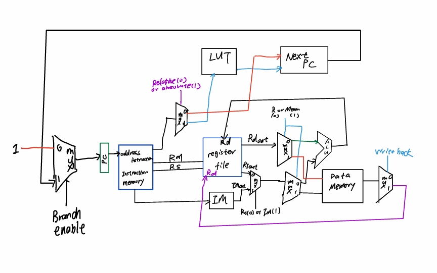

# Introduction


## Table of Contents
0. [Team Members](#0-team-members)
1. [Introduction](#1-introduction)
2. [Architectural Overview](#2-architectural-overview)
3. [Machine Specification](#3-machine-specification)
   - [Instruction Formats](#instruction-formats)
   - [Operations](#operations)
   - [Internal Operands](#internal-operands)
   - [Control Flow (Branches)](#control-flow-branches)
   - [Addressing Modes](#addressing-modes)
4. [Programmer’s Model [Lite]](#programmers-model-lite)
5. [Program Implementation](#5-program-implementation)
   - [Program 1 — Maximum and Minimum Hamming Distance](#program-1-pseudocode)
   - [Program 2 — A × B Signed Multiplication](#program-2-pseudocode)
   - [Program 3 — A × B × C Signed Multiplication](#program-3-pseudocode)

## 0. Team Members

| Team Member | PID |
|-------------|-----|
| Yu-Heng Lin | A18502009 |
| Linfeng Zhang | A18519381 |

## 1. Introduction
The name of this architecture is **PANDA**, stands for *pretty average, not-well designed architecture*. The main goal of this ISA is to provide a smooth and user-friendly programming experience when coding in the PANDA assembly. To achieve this, we designed a special encoding and instructions to provide a large number of registers(16 General Purpose Registers). Additionally, we introduced macro instructions that expand into lower-level instructions, improving usability and readability. The PANDA machine follows a load-store architecture, so users who are familiar with ARMS and MIPS can easily transition to PANDA.

## 2. Architectural Overview


## 3. Machine Specification

### Instruction Formats
| TYPE | FORMAT | CORRESPONDING INSTRUCTIONS |
|------|--------|-----------------------------|
| R  | 4 bits opcode, 1 bit for choosing source register rs or use the special register IM as the source(rs will be ignored), 2 bit destination register rd, 2 bit source register rs| ADD, ADC, SUB, AND, OR, XOR, MOV |
| B    | 4 bits opcode, 1 bit for choosing absolute branching or relative branching, 4 bit relative address/LUT index  | BLT, BGT, BEQ|
| CMP    |4 bits opcode, 1 bit for choosing source register rs or use the special register IM as the source(rs will be ignored), 2 bit destination register rd, 2 bit source register rs. | CMP |
| SHIFT  | 4 bits opcode, 1 bit for choosing direction(left or right), 1 bit for choosing it's arithmetics or logical shift, 1 bit unused, 2 bit dest register| SHIFT |
| MEM    | 4 bits opcode, 1 bit for choosing source register rs or use the special register IM as the source(rs will be ignored), 2 bit destination register rd, 2 bit source register rs| LOAD, STORE |
| IM  | 4 bits opcode,  5 bits for immediate| LOAD_IMMEDIATE|
| FUNCTIONAL  | 4 bits opcode,  1 bit unused, 2 bit for destination register indexing, 2 bit for source register indexing | SET_REG |

### Operations
|Instruction Number| NAME | TYPE | OP CODE | BIT BREAKDOWN | EXAMPLE | NOTES |
|------------------|------|------|---------|---------------|---------|-------|
|1| ADD = arithmetic add | R | 0000 | 4 bits opcode (0000), 1 bit for choosing source register rs(0) or use the special register IM(1) as the source(rs will be ignored), 2 bit destination register rd(xx), 2 bit source register rs(xx) | `ADD R0, R1 ⇔ 0000_0_00_01`, `ADD R0, IM ⇔ 0000_1_00_xx`| After `ADD`, `R0` holds result of `R0 + R1/R0 + IM`, and if there is a carry out, the special purpose register `CARRY=1`|
|2| ADC = arithmetic add with carry | R | 0001 | 4 bits opcode (0001), 1 bit for choosing source register rs(0) or use the special register IM(1) as the source(rs will be ignored), 2 bit destination register rd(xx), 2 bit source register rs(xx) | `ADC R0, R1 ⇔ 0001_0_00_01`, `ADC R0, IM ⇔ 0001_1_00_xx`| After `ADC`, `R0` holds result of `R0 + R1 + CARRY/R0 + IM + CARRY`, after done with `ADC`, special purpose register will be reset to 0, a.k.a `CARRY=0`|
|3| SUB = arithmetic sub | R | 0010 | 4 bits opcode (0010), 1 bit for choosing source register rs(0) or use the special register IM(1) as the source(rs will be ignored), 2 bit destination register rd(xx), 2 bit source register rs(xx) | `SUB R0, R1 ⇔ 0010_0_00_01`, `SUB R0, IM ⇔ 0010_1_00_xx`| After `SUB`, `R0` holds result of `R0 - R1/R0 - IM`|
|4| AND = logical and | R | 0011 | 4 bits opcode (0011), 1 bit for choosing source register rs(0) or use the special register IM(1) as the source(rs will be ignored), 2 bit destination register rd(xx), 2 bit source register rs(xx) | `AND R0, R1 ⇔ 0011_0_00_01`, `AND R0, IM ⇔ 0011_1_00_xx`| After `AND`, `R0` holds result of `R0 & R1/R0 & IM`|
|5| OR = logical or | R | 0100 | 4 bits opcode (0100), 1 bit for choosing source register rs(0) or use the special register IM(1) as the source(rs will be ignored), 2 bit destination register rd(xx), 2 bit source register rs(xx) | `OR R0, R1 ⇔ 0100_0_00_01`, `OR R0, IM ⇔ 0100_1_00_xx`| After `OR`, `R0` holds result of `R0 or R1/R0 or IM`|
|6| XOR = logical xor | R | 0101 | 4 bits opcode (0101), 1 bit for choosing source register rs(0) or use the special register IM(1) as the source(rs will be ignored), 2 bit destination register rd(xx), 2 bit source register rs(xx) | `XOR R0, R1 ⇔ 0101_0_00_01`, `XOR R0, IM ⇔ 0101_1_00_xx`| After `XOR`, `R0` holds result of `R0 ^ R1/R0 ^ IM`|
|7| MOV = MOVE value from one reg to the other | R | 0110 | 4 bits opcode (0110), 1 bit for choosing source register rs(0) or use the special register IM(1) as the source(rs will be ignored), 2 bit destination register rd(xx), 2 bit source register rs(xx) | `MOV R0, R1 ⇔ 0110_0_00_01`, `MOV R0, IM ⇔ 0110_1_00_xx`| After `MOV`, `R0` holds result of `R1/IM`|
|8| BLT = branch if less than | B | 0111 | 4 bits opcode (0111), 1 bit for choosing relative branching(0) or absolute branching(1), 4 bits(xxxx) for the relative address/LUT index. If the LT register is set, the program counter(PC) will be set to either </br>1. relative branching: PC += instruction size * 2's comp of relative address</br> 2. absolute branching PC = LUT[index] | `BLT_RELATIVE 4 ⇔ 0111_0_0100`, `BLT_ABSOLUTE 12 ⇔ 0111_1_1100`| After `BLT`, `PC` will be updated to the value previously described|
|9| BGT = branch if greater than | B | 1000 | 4 bits opcode (1000), 1 bit for choosing relative branching(0) or absolute branching(1), 4 bits(xxxx) for the relative address/LUT index. If the GT register is set, the program counter(PC) will be set to either </br>1. relative branching: PC += instruction size * 2's comp of relative address</br> 2. absolute branching PC = LUT[index] | `BGT_RELATIVE 4 ⇔ 1000_0_0100`, `BGT_ABSOLUTE 12 ⇔ 1000_1_1100`| After `BGT`, `PC` will be updated to the value previously described|
|10| BEQ = branch if equal | B | 1001 | 4 bits opcode (1001), 1 bit for choosing relative branching(0) or absolute branching(1), 4 bits(xxxx) for the relative address/LUT index. If the EQ register is set, the program counter(PC) will be set to either </br>1. relative branching: PC += instruction size * 2's comp of relative address</br> 2. absolute branching PC = LUT[index] | `BEQ_RELATIVE 4 ⇔ 1001_0_0100`, `BEQ_ABSOLUTE 12 ⇔ 1001_1_1100`| After `BEQ`, `PC` will be updated to the value previously described|
|11| CMP = compare | CMP | 1010 | 4 bits opcode (1010), 1 bit for choosing source register rs(0) or use the special register IM(1) as the source(rs will be ignored), 2 bit destination register rd(xx), 2 bit source register rs(xx). This instruction will compare the value of pairs (rd and rs) or (rd and IM) depending on the 5th bit, for simplification, we name the first operand A, and second operand B. There are 3 cases: </br> 1. A > B, then GT register will be set to 1 </br> 2. A < B, then LT register will be set to 1</br> 3. A == B, then EQ register will be set to 1| `CMP R0, R1 ⇔ 1010_0_00_01`, `CMP R0, IM ⇔ 1010_1_00_xx`| After `CMP`, At most one of the registers `LT`, `GT`, and `EQ` will be set to 1|
|12| SHIFT = general shift operation | SHIFT | 1011 | 4 bits opcode (1011), 1 bit for choosing direction(left(0) or right(1)) 1 bit for choosing it's logical(0) or arithmetics(1) shift, 1 bit unused(x), 2 bit dest register rd(xx).| `SHIFT_LEFT_LOGICAL R2 ⇔ 1011_0_0_x_10`, `SHIFT_RIGHT_LOGICAL R2⇔ 1011_1_0_x_10`, `SHIFT_LEFT_ARITHMETIC R2⇔ 1011_0_1_x_10`, `SHIFT_RIGHT_ARITHMETIC R2⇔ 1011_1_1_x_10`| After `SHIFT`, `R2` holds result of `R2 logical/arithmetic left/right shift by 1`|
|13| LOAD = load from memory | MEM | 1100 | 4 bits opcode (1100), 1 bit for choosing source register rs(0) or use the special register IM(1) as the source(rs will be ignored), 2 bit destination register rd(xx), 2 bit source register rs(xx) | `LOAD R0, R1 ⇔ 1100_0_00_01`, `LOAD R0, IM ⇔ 1100_1_00_xx`| After `LOAD`, `R0` holds result of `memory[R1]/memory[IM]`|
|14| STORE = store value to memory | MEM | 1101 | 4 bits opcode (1101), 1 bit for choosing source register rs(0) or use the special register IM(1) as the source(rs will be ignored), 2 bit destination register rd(xx), 2 bit source register rs(xx) | `STORE R0, R1 ⇔ 1101_0_00_01`, `STORE R0, IM ⇔ 1101_1_00_xx`| After `STORE`, `mem[R0]` holds result of `R1/IM`|
|15| LOAD_IMMEDIATE = loading immediate from LUT| IM | 1110 | 4 bits opcode (1110), 5 bits for LUT index(xxxxx) | `LOAD_IMMEDIATE 29 ⇔ 1110_11101`| After `LOAD_IMMEDIATE`, special purpose register `IM` holds result of `LUT[index]`|
|16| SET_REG = setting registers extension index| FUNCTIONAL | 1111 | 4 bits opcode (1111), 1 bit unused(x), 2 bit for destination register indexing(xx), 2 bit for source register indexing(xx) | `SET_REG 3, 2 ⇔ 1111_x_11_10`| After `SET_REG`, special purpose register `SRC_REG_IDX = 3`, `DEST_REG_IDX=2`, so that for the next instruction, their source register will be(assuming rs=2) `SRC_REG_IDX*4 + rs = 3*4+2=14`, so it will be using `R14` instead of `R2` for rs. Similarly, the the destination register will be (assuming rd=1) `DEST_REG_IDX*4 + rd = 2*4 + 1 = 9`, so it will be using `R9` instead of `R1` for rd. Once the next instruction is done, both special purpose register will be reset to 0 `SRC_REG_IDX<=0, DEST_REG_IDX<=0`. The purpose of this instruction is to expand the number of register that the programmer can use, in the cost of a higher CPI.|


### Internal Operands
There are 16 general purpose registers, 7 special purpose registers.

| Register | Purpose | Note |
|----------|---------|---------
| R0-R15   | General purpose |N/A|
| CARRY    | Special purpose |For `ADC`, will be set in case of carry out in `ADD`, will be cleared after `ADC`|
| LT       | Special purpose |Will be set in `CMP`, will be cleared in the next instruction after `CMP`|
| GT       | Special purpose |Will be set in `CMP`, will be cleared in the next instruction after `CMP`| 
| EQ       | Special purpose |Will be set in `CMP`, will be cleared in the next instruction after `CMP`| 
| IM       | Special purpose |Can be set by using `LOAD_IMMEDIATE` instruction|
| SRC_REG_IDX| Special purpose |Will be set by the `SET_REG` instruction, will be cleared after the next instruction of `SET_REG` is done|
| DEST_REG_IDX| Special purpose |Will be set by the `SET_REG` instruction, will be cleared after the next instruction of `SET_REG` is done|


### Control Flow (Branches)
Both relative and absolute branching are supported. For both relative and absolute branching, it will be using the extracted 4 bits. </br>
1. Relative branching: user can branch to max of 8 instructions before the PC, or max of 7 instructions after the PC. So [-8, 7] is the range.
2. Absolute Branching: user can branch to an absolute address that's hardcoded and stored in the LUT, the 4 bits will be unsigned and will be the index of the LUT. The values inside the LUT can be address of any instruction in the program. So this will be the way to handle large jumps.

Below is the method of using branching in PANDA:
| Branch Type | Target Address Mode | Example Call | Notes |
|-------------|----------------------------|--------------|-------|
| BEQ | RELATIVE/ABSOLUTE          | BEQ_ABSOLUTE/BEQ_RELATIVE | See concrete examples in the operation chart|
| BLT | RELATIVE/ABSOLUTE          | BLT_ABSOLUTE/BLT_RELATIVE | See concrete examples in the operation chart|
| BGT | RELATIVE/ABSOLUTE          | BGT_ABSOLUTE/BGT_RELATIVE | See concrete examples in the operation chart|


### Addressing Modes
Only indirect addressing is supported. If user wants to use immediate as operands for load/store or any other operations, they will have to be done by using the special `LOAD_IMMEDIATE` instruction. All of the immediates will be stored in a LUT, users can use indices to access the LUT and load the actual immediate into an `IM` special register, and use `IM` instead.

- Example
```PANDA
// assume R1 = 10
// assume IM = 300
LOAD R1, R0 // this will be R1 <- memory[R0] = memory[10]
LOAD R1, IM // this will be R1 <- memory[IM] = memory[300]
```

## Programmer’s Model [Lite]

1. Programmer's Strategy: The user should prioritize using as many general purpose registers provided as possible by utilizing the special `SET_REG` instruction. If all of the GPRs are used, the user can load/store stuff from/to memory, the memory operation can happen in between of other operations. If the user wants to use immediate, they must do it via the `LOAD_IMMEDIATE` instructions. For branching, the user can choose to branch relatively or absolutely, whichever they favor to choose.

4. Restrictions: Copying instructions from ARMS/MIPS generally won't work out of the box, due to the PANDA ISA needed `SET_REG` to use the other general purpose registers besides `R0-R3`. Other than that, the user should be careful using the store command in PANDA, since the operands order is differed from ARMS/MIPS(see the operation chart). Other than that, most of the common operations are supported in the PANDA ISA.


## 5. Program Implementation


### Program 1 Pseudocode
- Closest pair -- Write a program to find the smallest and largest Hamming distances among all pairs of values in an array of 16 bytes. Assume all values are 8-bit integers. The array of integers starts at location 0. Write the minimum distance in location 16 and the maximum distance in location 17. 

```c
#include <stdint.h>
#include <stdio.h>
#include <stdlib.h>

uint8_t max = 0;
uint8_t min = 0b11111111;

void hamming_distance()
{
    uint8_t num1 = 0b10101010;
    uint8_t num2 = 0b11111111;
    uint8_t num3 = 0b00000000;

    uint8_t arr[] = {num1, num2, num3};
    uint8_t size = 3;

    // find max
    for (int i = 0; i < size; i++)
    {
        for (int j = i + 1; j < size; j++)
        {
            uint8_t a = arr[i];
            uint8_t b = arr[j];

            uint8_t x = a ^ b;
            uint8_t distance = 0;

            while (1)
            {
                if (x == 0) break;
                distance = distance + (x & 1);
                x >>= 1;
            }
            if (distance > max) max = distance;
        }
    }

    // find min
    for (int i = 0; i < size; i++)
    {
        for (int j = i + 1; j < size; j++)
        {
            uint8_t a = arr[i];
            uint8_t b = arr[j];

            uint8_t x = a ^ b;
            uint8_t distance = 0;

            while (1)
            {
                if (x == 0) break;
                distance = distance + (x & 1);
                x >>= 1;
            }
            if (distance < min) min = distance;
        }
    }
}

int main()
{
    hamming_distance();
    printf("Hamming distance max is %u and Hamming distance min is %u", max, min);
    return 0;
}

```

### Program 2 Pseudocode
- 2-Term Product – For full credit, write a program that finds the product of two two’s complement numbers, ie, A * B. The operands are found in memory locations 0 (A), and 1 (B).  The result will be written into locations 2 (high bits) and 3 (low bits). Your ISA will not have a one-cycle “multiply” operation, so you will need some sort of shift-and-add algorithm. You may restrict your values to positive numbers (MSB = 0) only, with a 1/3-letter grade penalty for the course. 

```c
#include <stdint.h>
#include <stdio.h>

typedef int8_t int8;


void robertson_mul_2_num(int8 A, int8 B, int8* upper, int8* lower)
{
    // SPECIAL CASE: The algorithm fails for A = -128.
    // The one case the swap-workaround can't fix is -128 * -128.
    // -128 * -128 = 16384 (0x4000 in 16-bit)
    if (A == -128 && B == -128)
    {
        *upper = 0x40;
        *lower = 0x00;
        return; // Exit early
    }

    // WORKAROUND: Booth's N-bit algorithm fails when multiplicand A is -2^(N-1) (-128).
    // Since A*B = B*A, we just swap them if A is -128.
    // (This is now safe because we've already handled the A=-128, B=-128 case)
    if (A == -128)
    {
        int8 temp = A;
        A = B;
        B = temp;
    }

    int8 P = 0;   // accumulator (upper 8 bits)
    int8 Q = B;   // multiplier
    int8 Qm1 = 0; // Q-1, starts at 0

    for (int8 i = 0; i < 8; i++)
    {
        int8 Q0 = Q & 1; // current LSB of Q

        // Step 1: add/subtract depending on (Q0, Qm1)
        if (Q0 == 1 && Qm1 == 0)
        {
            // P = P - A
            P = P - A;
        }
        else if (Q0 == 0 && Qm1 == 1)
        {
            // P = P + A
            P = P + A;
        }

        // Step 2: arithmetic right shift of (P, Q, Qm1)
        int8 newQm1 = Q & 1; // save old Q0 before shift

        // Shift right Q, bring in P's LSB
        // We must do a logical shift right, so we mask with 0x7F
        Q = (Q >> 1) & 0x7F; 
        if (P & 1)
        {
            Q |= 0x80; // bring P LSB into Q MSB if it was 1
        }

        // Arithmetic shift right P
        // (P >>= 1) is arithmetic for signed types, but this is a
        // 100% portable way to guarantee it.
        int8 signP = P & 0x80;
        P >>= 1;
        if (signP) P |= 0x80; // keep sign bit

        // Update Qm1
        Qm1 = newQm1;
    }

    *upper = P;
    *lower = Q;
}


int main()
{
    // Use 32-bit integers for loop counters to safely iterate
    // from -128 to 127 without overflow/wrap-around issues.
    int32_t a_val, b_val;
    long long pass_count = 0;
    long long fail_count = 0;
    long long total_tests = 0;

    printf("Starting exhaustive 8-bit multiplication test (256 * 256 = 65536 cases)...\n");

    for (a_val = -128; a_val <= 127; a_val++)
    {
        for (b_val = -128; b_val <= 127; b_val++)
        {
            total_tests++;
            
            // Cast loop counters to the int8 type for the function
            int8 a = (int8)a_val;
            int8 b = (int8)b_val;
            
            // Variables to hold the function's output
            int8 hi, lo;
            
            // Calculate the expected result using 16-bit C multiplication
            int16_t expected_result = (int16_t)a * (int16_t)b;
            
            // Run the function
            robertson_mul_2_num(a, b, &hi, &lo);
            
            // Combine the hi/lo output, casting 'lo' to (uint8_t) to prevent sign extension
            int16_t actual_result = ((int16_t)hi << 8) | ((uint8_t)lo);
            
            // Check for mismatch
            if (expected_result != actual_result)
            {
                fail_count++;
                // Print only the first 100 errors to avoid spamming the console
                if (fail_count <= 100)
                {
                    printf("\nFAIL: %d * %d\n", a, b);
                    printf("  Expected: %d (0x%04X)\n", expected_result, (uint16_t)expected_result);
                    printf("  Actual:   %d (0x%04X) [hi=0x%02X, lo=0x%02X]\n", 
                           actual_result, (uint16_t)actual_result, (uint8_t)hi, (uint8_t)lo);
                }
                continue;
            }
        pass_count++;
        }
    }
    
    // Print summary
    printf("\n\n--- Test Summary ---\n");
    printf("Total Tests: %lld\n", total_tests);
    printf("Passed:      %lld\n", pass_count);
    printf("Failed:      %lld\n", fail_count);
    

    (fail_count == 0) ? printf("\nSUCCESS: All 65536 test cases passed!\n") : printf("\nFAILURE: %lld test cases failed.\n", fail_count);
    return 0;
}
``` 

### Program 3 Pseudocode
- 3-Term Product – For full credit, write a program that finds the product of three two’s complement numbers, ie, A * B * C. The operands are found in memory locations 0 (A), and 1 (B), and 2 (C).  The result will be written into locations 4 (highest bits), 5 (middle bits), and 6 (low bits). Your ISA will not have a one-cycle “multiply” operation, so you will need some sort of shift-and-add algorithm. You may restrict your values to positive numbers (MSB = 0) only, with a 1/3-letter grade penalty for the course.  

```c
#include <stdint.h>
#include <stdio.h>

typedef signed char int8;

/*
 * Multiply signed A*B*C (each int8).
 * Result is 24-bit signed stored in (upper, mid, lower) all int8.
 *
 * Approach:
 * 1) m = A * B  using Booth 8x8 -> 16 bits (m_hi:m_lo)
 * 2) result = m * C using Booth with 16-bit multiplicand (m_hi:m_lo) and 8-bit multiplier C
 *    -> produce 24-bit result (p2:p1:p0)
 */
void mul3_signed_8x8x8(int8 A, int8 B, int8 C, int8* upper, int8* mid, int8* lower)
{
    // Step 1: A * B -> m_hi:m_lo (16-bit signed)
    int8 m_hi = 0, m_lo = 0;
    // Use Booth for 8x8 -> 16. We implement a compact version here directly:

    int8 P = 0;
    int8 Q = B;
    int8 Qm1 = 0;
    for (int i = 0; i < 8; i++)
    {
        int8 Q0 = Q & 1;
        if ((Q0 == 1) && (Qm1 == 0))
        {
            // P = P - A
            P = P - A;
        }
        else if ((Q0 == 0) && (Qm1 == 1))
        {
            // P = P + A
            P = P + A;
        }
        int8 newQm1 = Q & 1;
        // shift Q right, bring P LSB into Q MSB
        uint8_t qu = (uint8_t)Q;
        uint8_t pu = (uint8_t)P;
        qu = (qu >> 1) | ((pu & 1) ? 0x80 : 0x00);
        Q = (int8)qu;
        // arithmetic shift P right
        int8 signP = P & 0x80;
        P = (P >> 1);
        if (signP) P |= 0x80;
        Qm1 = newQm1;
    }
    m_hi = P;
    m_lo = Q;

    // Step 2: Multiply 16-bit (m_hi:m_lo) by C (8-bit) -> 24-bit (p2:p1:p0)
    // We'll perform Booth on multiplier C (8 iterations), with accumulator P = 16-bit (p_hi:p_lo)
    // The combined register layout is [P_hi(8) P_lo(8) Q(8) Q-1(1)] -> 25 bits; shifting is done across these bytes.
    int8 p_hi = 0; // top 8 bits of 24-bit accumulator (will become final upper)
    int8 p_lo = 0; // middle 8 bits of 24-bit accumulator
    Q = C;    // multiplier (low 8 bits of final product)
    Qm1 = 0;

    for (int i = 0; i < 8; i++)
    {
        int8 Q0 = Q & 1;
        if ((Q0 == 1) && (Qm1 == 0))
        {
            // P = P - M  (M is m_hi:m_lo)
            // Implement P = P - M as P + (~M + 1)
            // Step: compute ~M
            int8 inv_m_lo = ~m_lo;
            int8 inv_m_hi = ~m_hi;

            // add inv_m_lo + 1 to p_lo with carry propagation
            int sum_lo = (uint8_t)p_lo + (uint8_t)inv_m_lo + 1;
            p_lo = (int8)sum_lo;
            int carry = (sum_lo >> 8) & 1;

            int sum_hi = (uint8_t)p_hi + (uint8_t)inv_m_hi + carry;
            p_hi = (int8)sum_hi;
        }
        else if ((Q0 == 0) && (Qm1 == 1))
        {
            // P = P + M  (add m_lo into p_lo, m_hi into p_hi)
            int sum_lo = (uint8_t)p_lo + (uint8_t)m_lo;
            p_lo = (int8)sum_lo;
            int carry = (sum_lo >> 8) & 1;

            int sum_hi = (uint8_t)p_hi + (uint8_t)m_hi + carry;
            p_hi = (int8)sum_hi;
        }

        // Arithmetic right shift of (p_hi : p_lo : Q : Qm1)
        int8 newQm1 = Q & 1;

        // Shift Q right, bring p_lo LSB into Q MSB
        uint8_t qu = (uint8_t)Q;
        uint8_t plu = (uint8_t)p_lo;
        qu = (qu >> 1) | ((plu & 1) ? 0x80 : 0x00);
        Q = (int8)qu;

        // Shift p_lo right, bring p_hi LSB into p_lo MSB
        uint8_t phu = (uint8_t)p_hi;
        uint8_t new_p_lo = ((uint8_t)p_lo >> 1) | ((phu & 1) ? 0x80 : 0x00);
        p_lo = (int8)new_p_lo;

        // Arithmetic shift p_hi right (preserve sign)
        int8 signPH = p_hi & 0x80;
        p_hi = (p_hi >> 1);
        if (signPH) p_hi |= 0x80;

        Qm1 = newQm1;
    }

    // Final 24-bit product is (p_hi : p_lo : Q)
    *upper = p_hi;
    *mid = p_lo;
    *lower = Q;
}

/* small test harness (prints 24-bit signed result) */
int main(void)
{
    int8 A = -15;
    int8 B = 12;
    int8 C = -3;

    int8 up, mid, low;
    mul3_signed_8x8x8(A, B, C, &up, &mid, &low);

    // For printing combined signed 24-bit, do a manual combine into 32-bit int (only for display).
    int32_t signed24 = ((int32_t)(int8)up << 16) | ((uint32_t)(uint8_t)mid << 8) | (uint32_t)(uint8_t)low;
    // Sign-extend from 24 to 32 bits:
    if (signed24 & (1 << 23)) signed24 |= ~((1 << 24) - 1);

    printf("A=%d, B=%d, C=%d => product = %d (bytes: 0x%02X 0x%02X 0x%02X)\n",
           A, B, C, signed24, (uint8_t)up, (uint8_t)mid, (uint8_t)low);

    return 0;
}
```