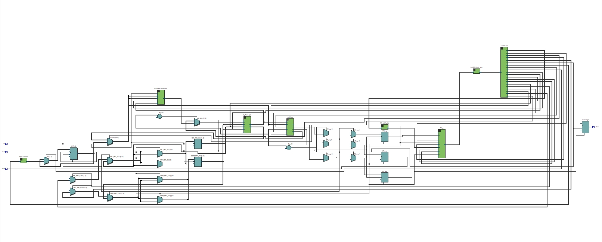
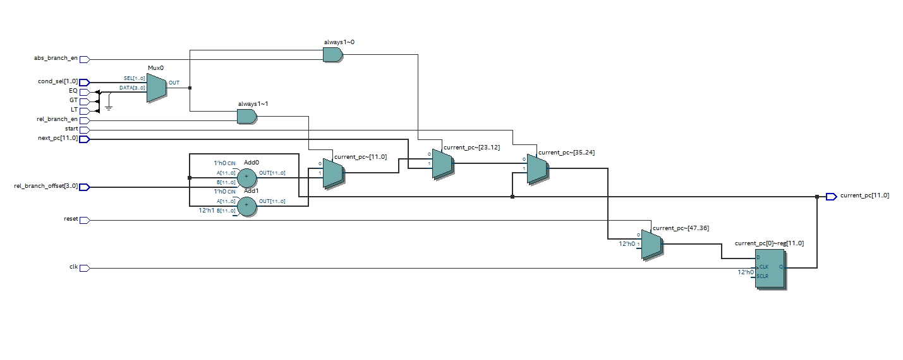
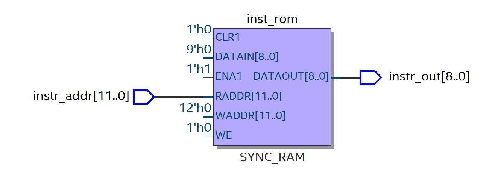
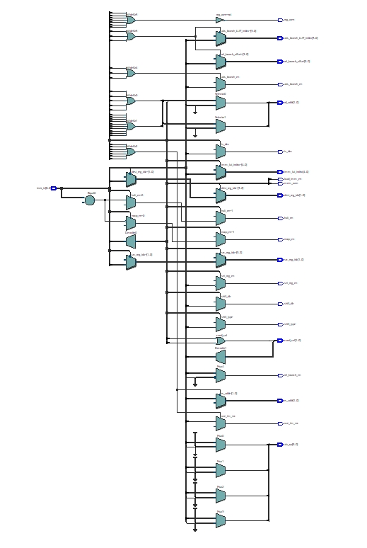
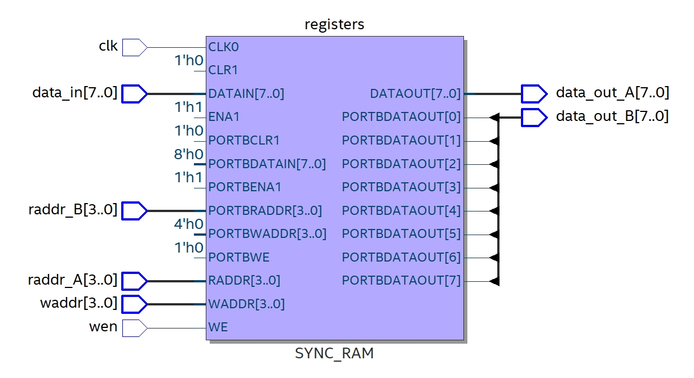
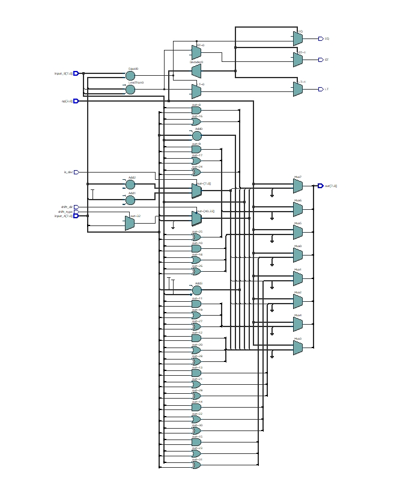
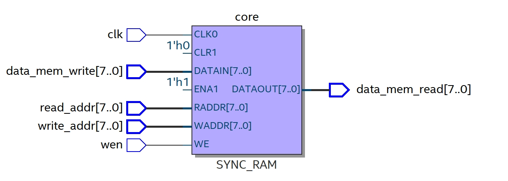
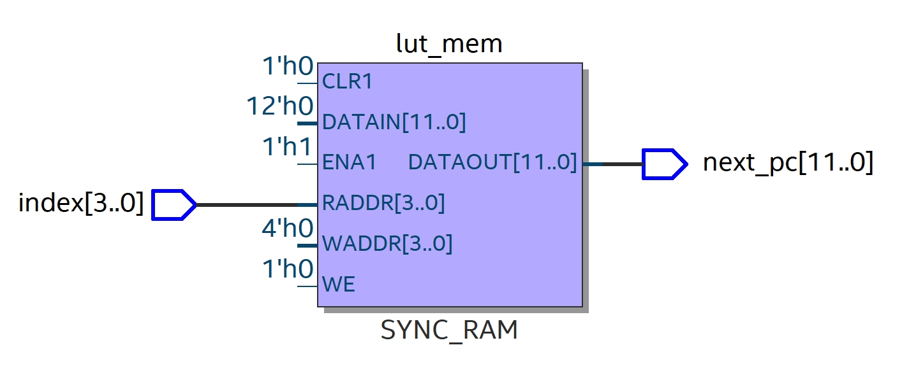
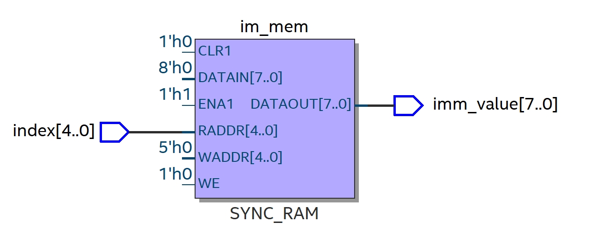

# Individual Component Specification

## Top Level
### Module file name: Top.sv
### Functionality Description
This module initializes the instances of other modules (PC, LUTs, DataMem, Control, ALU, and RegFile).  
It also contains the special register (IM) and registers the ALU flags for the next cycle.

### Schematic

---

## Program Counter
### Module file name: PC.sv
### Functionality Description
This module implements the program counter, which can branch absolutely (`PC = new PC`) or relatively (2’s complement offset)  
based on the control signals and the ALU flags passed in. The PC is 12 bits wide.

### Schematic

---

## Instruction Memory
### Module file name: InstrROM.sv
### Functionality Description
This module implements the instruction memory, where it preloads the instructions (9 bits wide) into a 2D array.  
Every cycle the PC advances or changes, the instruction at that address is output via the `instr_out` signal.  
The instruction memory is read-only and entirely combinational.

### Schematic

---

## Control Decoder
### Module file name: Control.sv
### Functionality Description
This module implements the control decoder, which parses different control signals or data that the ALU or memory operations need,  
and correctly decodes the operation type of the current instruction. This module is entirely combinational.

### Schematic

---

## Register File
### Module file name: RegFile.sv
### Functionality Description
This module implements the register file. It supports one synchronous write (on the rising edge of `clk`)  
and two asynchronous/combinational reads within a single cycle. The datapath width is 8 bits.

### Schematic

---

## ALU (Arithmetic Logic Unit)
### Module file name: ALU.sv
### Functionality Description
This module implements the ALU. It performs various arithmetic and logical operations depending on the input opcode.  
The ALU outputs the result of the operation (`out`) and three comparison flags: `EQ`, `LT`, and `GT`.  
This module is entirely combinational.

### ALU Operations
**Demonstrated operations:**
1. ADD  
2. AND  
3. INC / DEC  
4. SUB  
5. OR  
6. XOR  
7. MOV  
8. CMP  
9. SHIFT  

### Schematic

---

## Data Memory
### Module file name: DataMem.sv
### Functionality Description
This module implements the data memory. It allows one synchronous write (on the rising edge of `clk`)  
and one asynchronous/combinational read in a single cycle. The datapath width is 8 bits.

### Schematic

---

## Lookup Tables
### Module file names: PC_LUT.sv, IM_LUT.sv
### Functionality Description
These modules implement lookup tables for:
- **PC_LUT** — used for absolute branch addresses  
- **IM_LUT** — used for storing larger 8-bit immediate values  

Both tables are preloaded, and reads are performed combinationally based on the given index.

### Schematics
#### PC_LUT

#### IM_LUT

